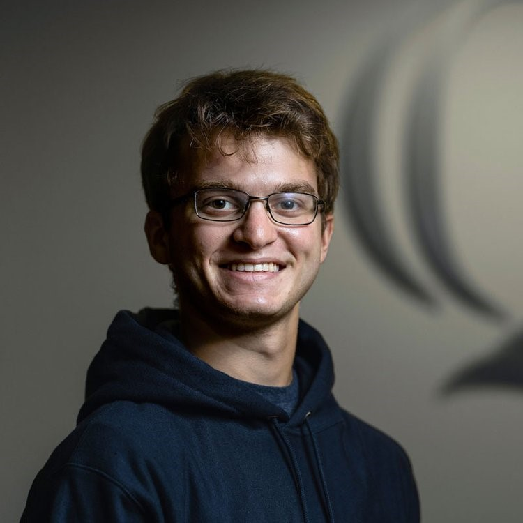

# About Me

[Home](./)

### My name is Garrett Goldberg.

I'm a resident in Cheshire, CT, and am currently enrolled at Quinnipiac University
as a Computer Science Major. I previously attended Cheshire High School, where I found my passion for technology.
I've always been surrounded by computers, and now I've finally gotten a chance to put that experience
to good use.

### Hobbies

My hobbies consist of going to the gym, soccer, and video games. I've always been an athlete, yet technology
always held a certain importance in my lifestyle. I'm currently part of the esports team at Quinnipiac as well.
I am currently am learning Java at University, and plan on putting my experience to good use ASAP.

#### If you would like to contact me, my info is below.

**Mobile Phone**: (203) 901 - 0898

**Email**: gegoldberg@quinnipiac.edu

<!-- The about page is your chance to talk about yourself. On here, give a brief description of your schooling
and what got you into the computer science field, your current experience, your interests, and anything
else you would like to add. Please include a picture of yourself and any pets (interviewers love pets). -->
